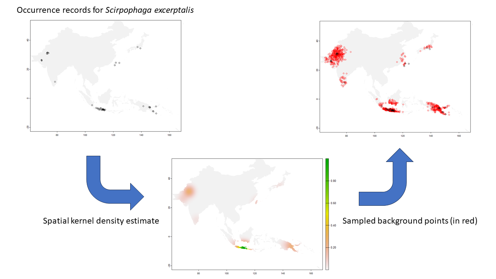

```{r setup, include=FALSE}
knitr::opts_chunk$set(echo = FALSE, warning = FALSE, message = FALSE)
library(tidyverse)
library(sf)

sp_all <- st_read("data/sp_all.gpkg") %>% as_tibble() %>% count(species)
```

### Species data
#### Occurrence data

Species data were extracted from the Global Biodiversity Information Facility (**GBIF**; [gbif.org](https://www.gbif.org)) database. The records were checked against the known distribution of each pest in the Centre for Agriculture and Bioscience International (**CABI**; [cabi.org](https://www.cabi.org)) database.

Six sugar cane pest species had occurrence data available in GBIF: *Chilo infuscatellus*, *Eumetopina flavipes*, *Perkinsiella saccharicida*, *Scirpophaga excerptalis*, *Sesamia grisescens*,  and *Yamatotettix flavovittatus*. However, the actual number of records varied greatly between species:

```{r echo = FALSE, message = FALSE, warning = FALSE}
library(knitr)

kable(sp_all)
```

This should be kept in mind, and the models for species with lower record counts (especially *E. flavipes* and *Y. flavovittatus*) may be unreliable.

#### Background sample

To model species presence-only data with statistical models a random sample of background data needs to be extracted from the landscape of interest. However, if sampling bias occurs in the presence-only data, it can lead to biased model results (Phillips et al. 2009). We accounted for this by generating a bias layer for each species and sampling background points weighted by the bias layer, so that background points are sampled with the same spatial density as presence data.

For each species we created a spatial kernel density estimate around its occurrence records, projected onto a raster masked to only include countries in which the species is known to occur. We then generated 1000 background samples for each species by randomly sampling from the masked raster, with the sampling probability for each cell weighted by the spatial kernel density estimate.



### Species distribution modelling

Since there are only few records per species, we fitted a logistic binary regression using a Hierarchical Generalized Additive Model (**HGAM**; Pedersen et al. 2019) with Point Process weighting (Fithian & Hastie 2013) to increase the predictive power of the model.

We downloaded global layers of 19 bioclimatic variables representing the mean, extremes, and variation in temperature and precipitation from WorldClim v2.1 (Fick et al. 2017), and a layer of the Landsat Enhanced Vegetation Index (EVI; Masek et al. 2006, Vermote et al. 2016). We then used Principal Coordinate Analysis (PCA) to convert the layers into orthogonal Principal Components (PCs) to reduce colinearity in the predictor variables. We used the 4 first PCs, which collectively explain 91.8% of the variation in the bioclimatic variables, as predictor variables for the HGAM model.

The model was trained on a random sample of 80% of the data, and model performance was evaluated by making predictions on the remaining 20% and calculating the area under the receiver operating characteristic curve (AUC). The model achieved good predictive performance, with an AUC score of 0.85.

We then used to model to make predictions for all cells in Australia and projected the resultant habitat suitability scores onto a map of Australia.

### Host plants

To see how climatic suitability coincides with host plant suitability in Australia, we downloaded a dataset showing the location and extent of select agricultural, mining and forest product commodities from the Catchment Scale Land Use of Australia – Commodities – Update December 2020 (ABARES 2021). We filtered this to include sugar cane, as well as other crops identified as host plants for some of the six considered pests: barley, maize, oats, rice, sorghum, and wheat. The extent of each of these commodities' growing regions can be plotted on top of the climatic suitability maps.

### References

ABARES (2021) Catchment Scale Land Use of Australia – Update December 2020. Australian Bureau of Agricultural and Resource Economics and Sciences, Canberra.

Fick, S.E. & Hijmans, R.J. (2017) WorldClim 2: new 1km spatial resolution climate surfaces for global land areas. International Journal of Climatology. 37, 4302–4315.

Fithian, W. & Hastie, T. (2013) Finite-sample equivalence in statistical models for presence-only data. The Annals of Applied Statistics. 7, 1917–1939.
   
Masek, J.G., Vermote, E.F., Saleous, N., Wolfe, R., Hall, F.G., Huemmrich, F., Gao, F., Kutler, J. & Lim, T.K. (2006) A Landsat surface reflectance data set for North America, 1990-100. IEEE Geoscience and Remote Sensing Letters. 3, 68-72.

Pedersen, E.J., Miller, D.L., Simpson, G.L. & Ross, N. (2019) Hierarchical generalized additive models in ecology: an introduction with mgcv. PeerJ, 7, e6876.

Phillips, S.J., Dudik, M., Elith, J., Graham, C.H., Lehmann, A., Leathwick, J. & Ferrier, S. (2009) Sample selection bias and presence-only distribution models: implications for background and pseudo-absence data. Ecological Applications 19, 181–197.

Vermote, E., Justice, C., Claverie, M., & Franch, B. (2016) Preliminary analysis of the performance of the Landsat 8/OLI land surface reflectance product. Remote Sensing of Environment, 185, 46-56.


