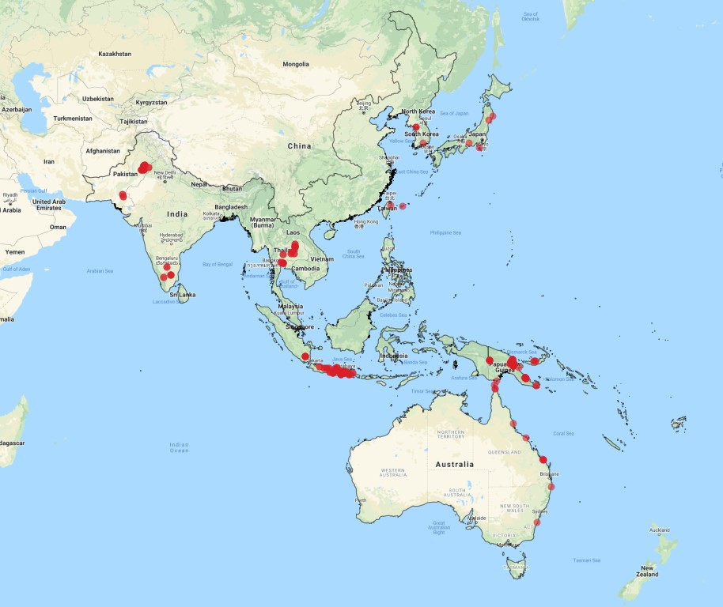

```{r setup, include=FALSE}
knitr::opts_chunk$set(echo = FALSE, warning = FALSE, message = FALSE)
```

### Species data
#### Occurrence data
Species data are extracted from the GBIF ([gbif.org](https://www.gbif.org)) database. The records are checked against the knows distribution of each pest in CABI ([cabi.org](https://www.cabi.org)) database. Six spcies had occurrence data in GBIf including Scirpophaga excerptalis, Sesamia grisescens, Chilo infuscatellus, Eumetopina flavipes, Yamatotettix flavovittatus and Perkinsiella saccharicida.


<!-- ```{r fig.width=6, fig.height=7} -->
<!--  -->

<!-- ``` -->


#### Background sample

To model the species presence-only data with statistical models a random sample of background data is extracted from the landscape of interest. To take to account for the possible observation bias in the occurrence data we used a bias layer which was a fucntion of accibility and proximity to all observed locations.


### Species distribution modelling

There are only few records per species, so we used a Hierarchical Generalized Additive Model (**HGAM**; Pearson et al. 2019) with Point Process weighting (Fithian & Hastie 2013) to increase the predictive power of the model.


### References

Fithian, W. & Hastie, T. (2013) Finite-sample equivalence in statistical models for presence-only data. The Annals of Applied Statistics, 7, 1917–1939.
   
Pedersen, E.J., Miller, D.L., Simpson, G.L. & Ross, N. (2019) Hierarchical generalized additive models in ecology: an introduction with mgcv. PeerJ, 7, e6876.


